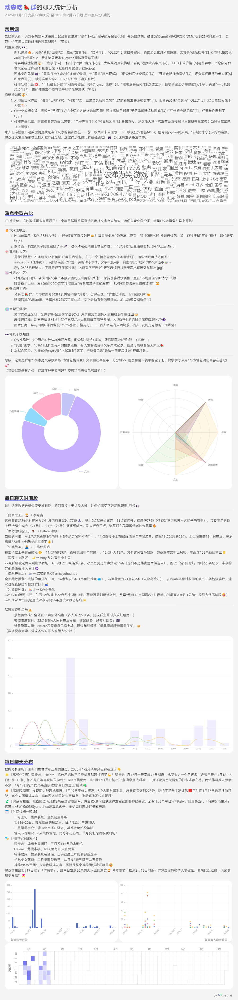
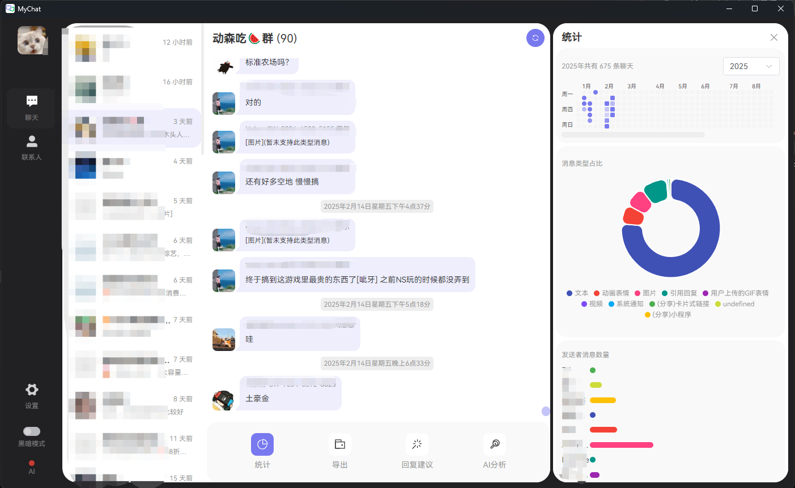
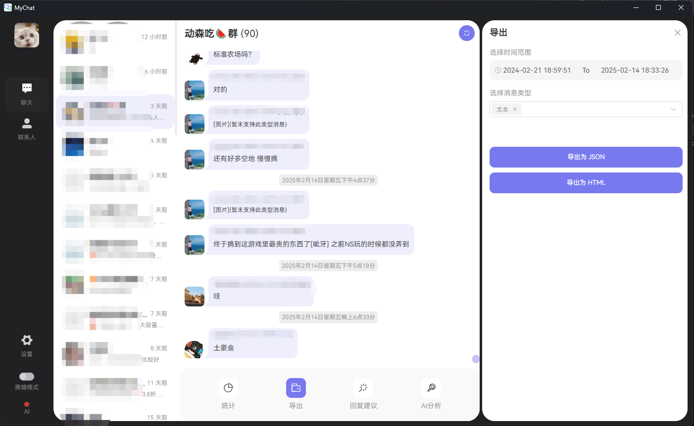
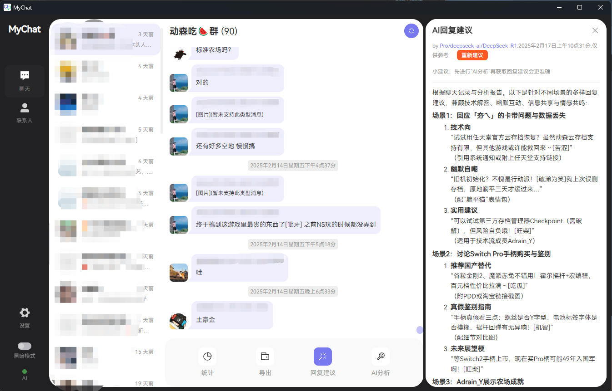
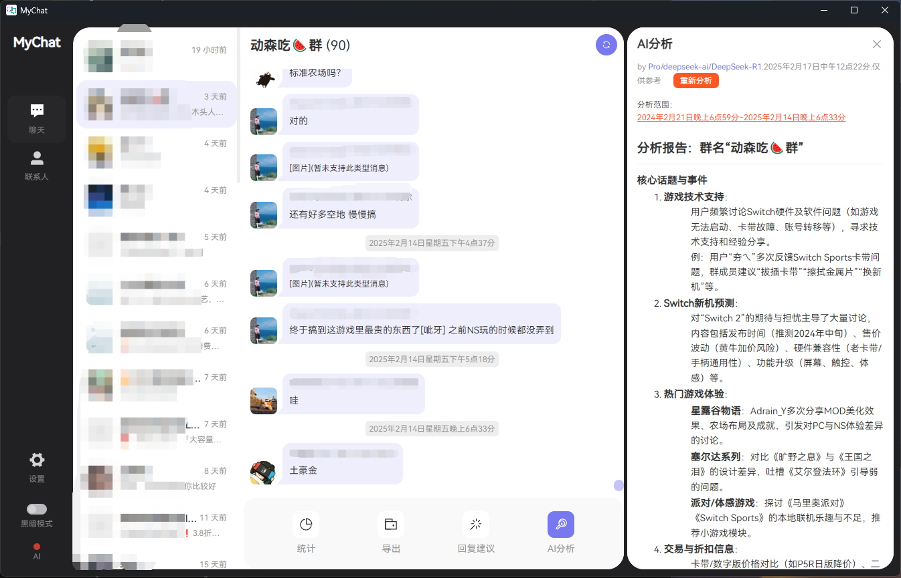

##### `欢迎为项目点亮⭐️，您的支持是我持续改进的动力！`

#  mychat

使用Electron(vue3+ts)和python开发的具有现代化UI和友好交互的**微信聊天数据智能管理分析工具**。

## 功能

1. 统计信息

- ✅聊天日期分布图
- ✅消息类型占比
- ✅发送者消息数量统计
- ✅聊天时间统计
- ✅导出统计图表(v1.1)
- ✅AI解读统计图表(v1.1.1)

2. 聊天导出

- ✅导出为JSON
- ✅导出为HTML
- ✅导出为TXT(v1.1.2)
- ✅导出为长图(v1.1.3)
- ✅导出文字类型消息
- ❌导出图片类型消息
- ❌导出语音类型消息

3. AI赋能

- ✅AI回复建议
  通过分析上下文，为用户提供智能、高效、符合语境的回复建议，提升沟通效率。
- ✅AI分析
  对聊天内容进行从核心话题与事件、 关系分析、聊天节奏、互动方式、情感表达、用户画像、隐含需求与建议等方面的深度分析，帮助用户更好地理解对话内容。
- ❌AI搜索
  快速、精准地搜索聊天记录中的特定内容，帮助用户快速定位关键信息，提升信息检索效率。

4. 其他功能

- ✅获取最新微信消息
- ✅查看所有联系人
- ✅黑暗模式

## 预览

统计分析报告：

运行截图：

## 构建

- 开发环境
  windows11，node18，python3
- 步骤1.`npm install` 2.`pip install -r ./py/requirements.txt` 3. 开发
  `npm run dev ` 4. 打包 # For windows
  `npm run build:win`

###### 只测试了在64位windows环境的开发打包运行流程

## 感谢

本项目中的微信数据库解密python脚本来自[PyWxDump](https://github.com/xaoyaoo/PyWxDump)项目。
